# Practica-NGINX
## Trabajo realizado por Javier García Santiago y Pablo López Cabezas.
### Parte de Javier García, haciendo la parte de Docker.

## NGINX-I

### 1. Instalación Docker:
Primeramente tenemos que comprobar que tenemos Docker Desktop instalado y eso lo podemos hacer mediante **docker --version**:

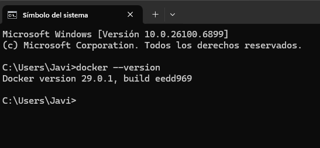

En mi caso si lo tengo, pero si no lo tuvieramos tendríamos que descargarlo, siguiendo los pasos de la página web de Docker.

### 2. Creación de la Estructura de Carpetas:
Una vez visto que tenemos docker, clonamos nuestro repositorio de github a nuestro equipo local y comenzamos a hacer la estructura que va a tener nuestro proyecto.

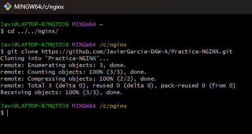

Y dentro de el, en la carpeta **html** clonamos el repositorio que dejastes en la entrega: **git clone https://github.com/cloudacademy/static-website-example .** 
El cuál lo he organizado de la siguiente forma:

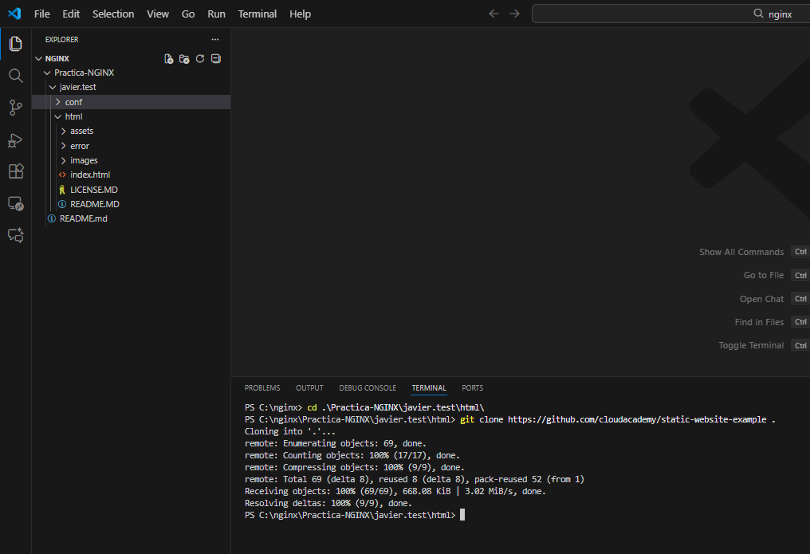

### 3. Configuración de servidor web NGINX con Docker
Creamos el archivo de configuración **nginx.conf** dentro de la carpeta **conf**, y lo rellenamos con la siguiente información (en mi caso he puesto javier.test):

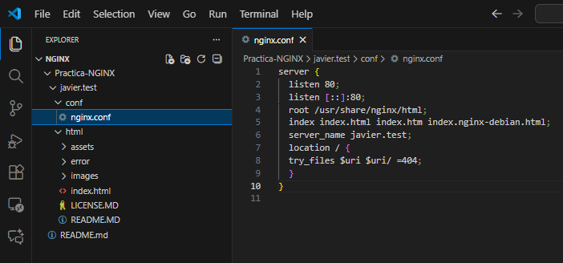

Una vez editado creamos un contenedor docker que ejecute nginx con un **docker run** y comprobamos que lo ha montado con un **docker ps -a**:

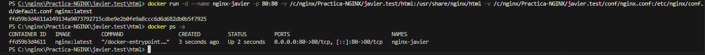

Y para ver los logs del contenedor lo podemos hacer mediante un **docker logs -f nginx-javier**:

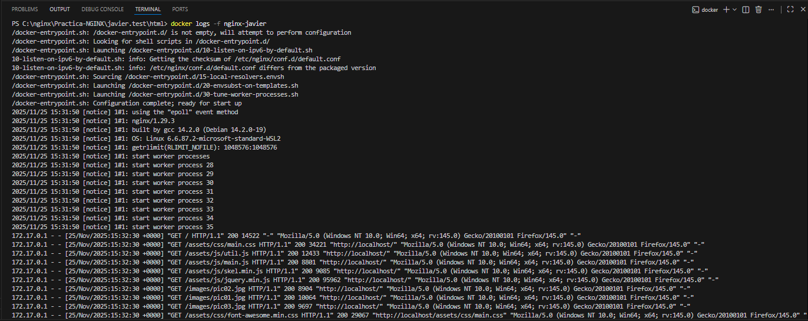

Una vez hecho todo esto, comprobamos en nuestro Docker Desktop que está el contenedor:

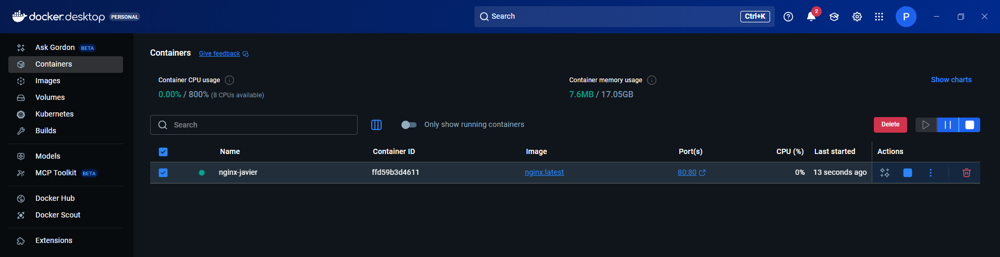

### 4. Comprobación del funcionamiento:
Viendo que existe nuestro contenedor y que está funcionando correctamente y vemos que el servidor está funcionando bien accediendo a **http://localhost**, y comprobamos que nos salga lo siguiente:

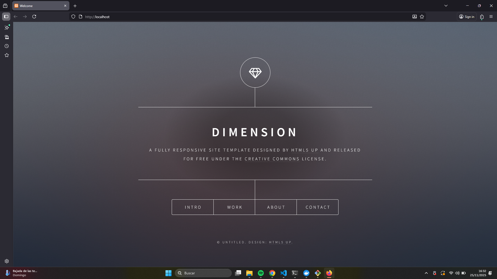

Editamos el archivo de host, que en en Windows se encuentra en la siguiente ubicación **C:\Windows\System32\drivers\etc** y añadimos donde está **127.0.0.1** el nombre de nuestro servidor( en mi caso javier.test )

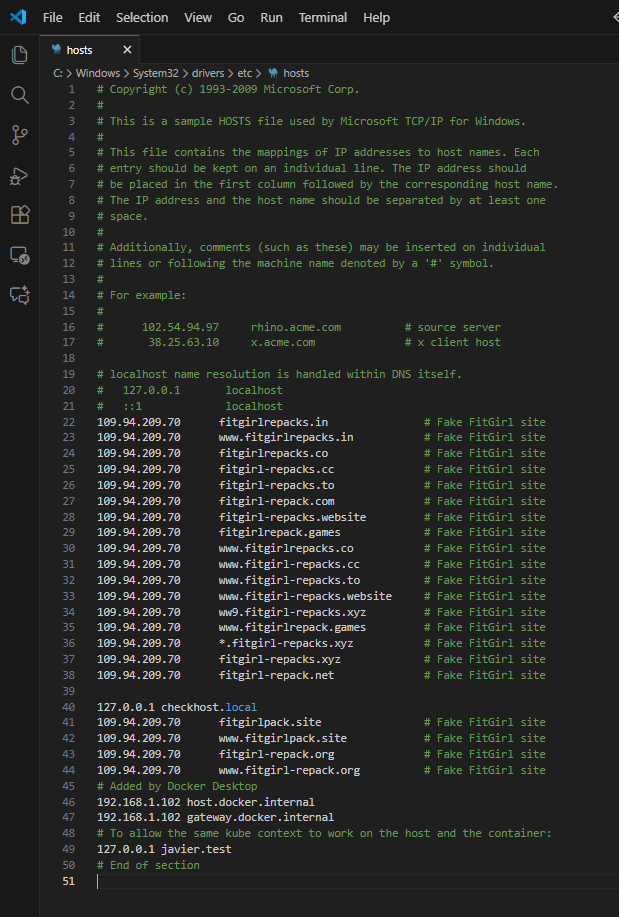

Ahora con poner en nuestro navegador en la url el nombre de nuestro servidor saldrá nuestra página

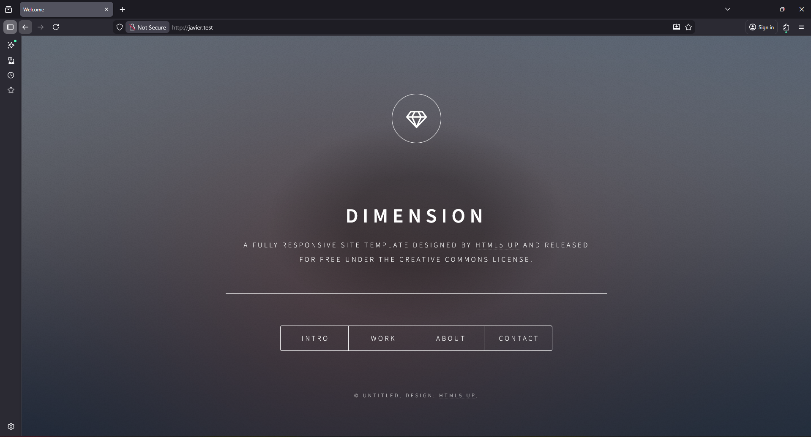

Como también podemos acceder **nip.io** que es añadiendo en la url de nuestro servidor **.nip.io**

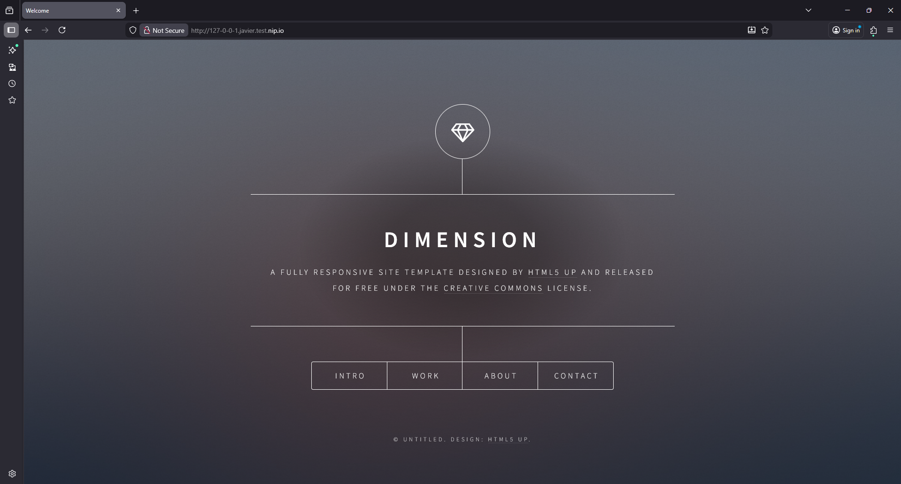

### 5. Gestión del contenedor

Para detener, reiniciar y eliminar el contenedor, tenemos que añadir la palabra correspondiente en esta sentencia: **docker stop/restart/rm nginx-javier**:

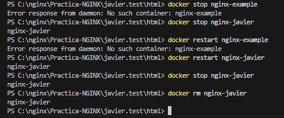

### 6. Docker-compose

Docker-compose nos permite una configuración mas robusta y fácil de reproducir, y para conseguirlo, en la carpeta de nuestro proyecto (javier.test), creamos el archivo **docker-compose.yml** y le introducimos el siguiente contenido:

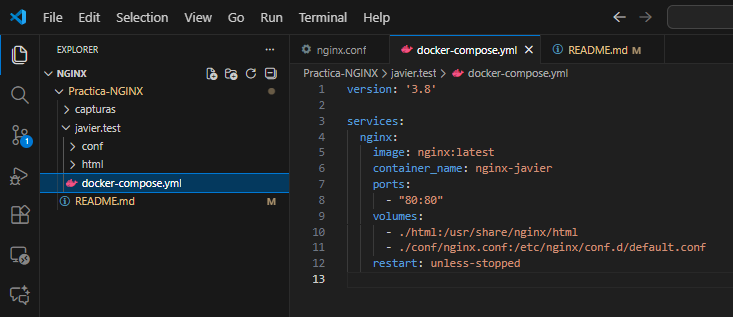

Para ejecutarlo debemos de hacer un **up -d**:

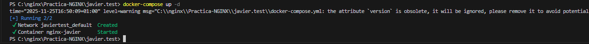

Para ver los logs hacemos un **docker-compose logs -f**:

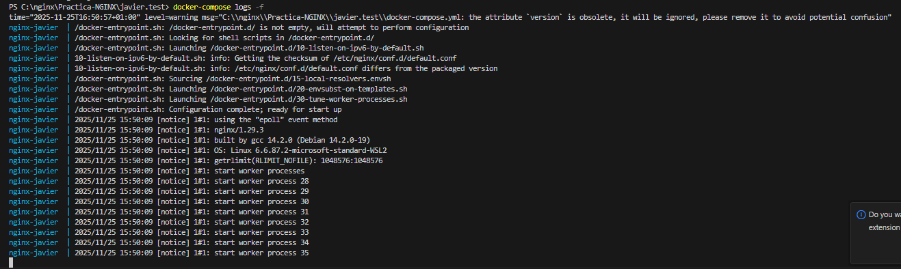

Y para detenerlo ejecutamos un **docker-compose down**:

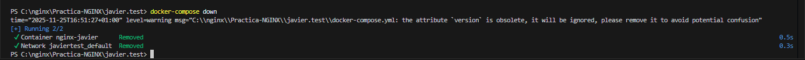

## NGINX-II

Para esta parte de la práctica utilizaremos utilidades de OpenSSL, que ya están disponibles en el contenedor de **stakater/ssl-certs-generator**.

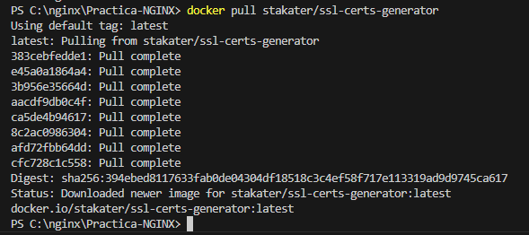

Una vez hecho esto lo siguiente será crear los usuarios y sus contraseñas, los cuáles estarán en el fichero **conf/htpasswd**. Y en la htpasswd-createprimera línea ponemos el nombre del primer usuario.

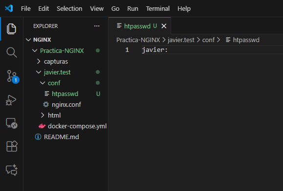

Ahora a dicho usuario le vamos a crwar una contraseña de forma no interactiva con el comando **docker run**, de la siguiente forma y con los siguientes parámetros:

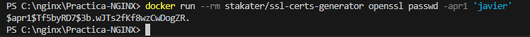

Copiamos lo que nos ha generado(incluyendo el punto) y lo pegamos en la línea de nuestro usuario.

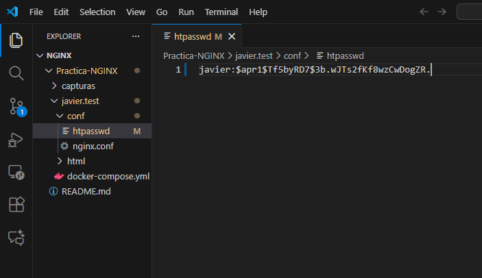

Una vez puesta la contraseña en nuestro usuario, vamos a hacer que para entrar a nuestro sitio web, nos pida una autentificación( poner usuario y contraseña ). Esto se hace en el archivo **nginx.conf** de la siguiente forma:

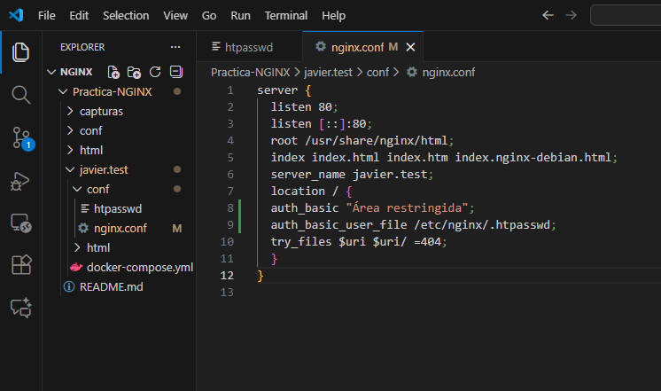

Como vemos le tenemos que indicar que es un área restringida, y en que archivo se encuentran los usuarios junto con sus contraseñas que pueden acceder a ese sitio web. Y tendríamos que hacer un **docker run** indicándole el nombre del contenedor, el puerto que va a ocupar, el montaje del archivo de configuración, el de contraseñas, etc... Y una vez hecho eso comprobamos si es cierto que nos pide autentificación para acceder, si no, nos debería de salir un error.

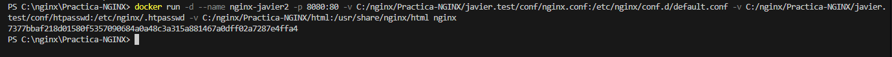

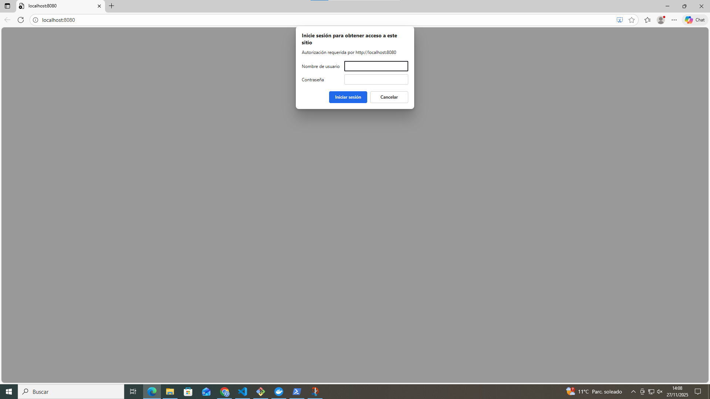

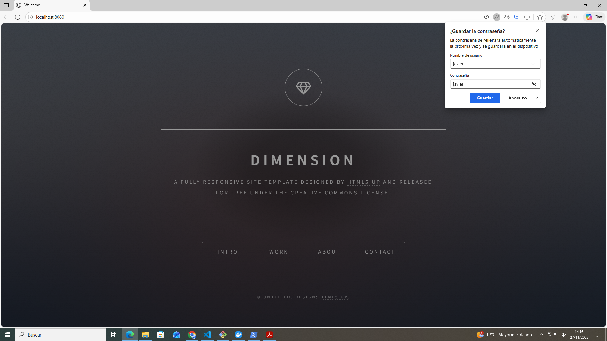

Como podemos comprobar, nos deja acceder con nuestro usuario y contraseña correctos, pero si le damos a cancelar y no ponemos ningún usuario nos sale lo siguiente:

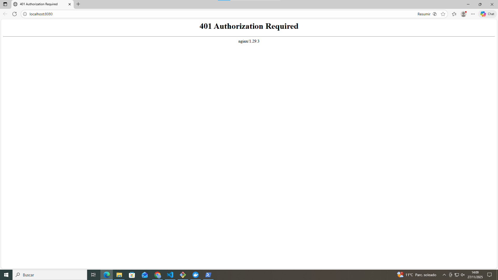

Dentro de los logs del contenedor de Docker Desktop, podemos comprobar si las respuestas han sido satisfactorias o no.

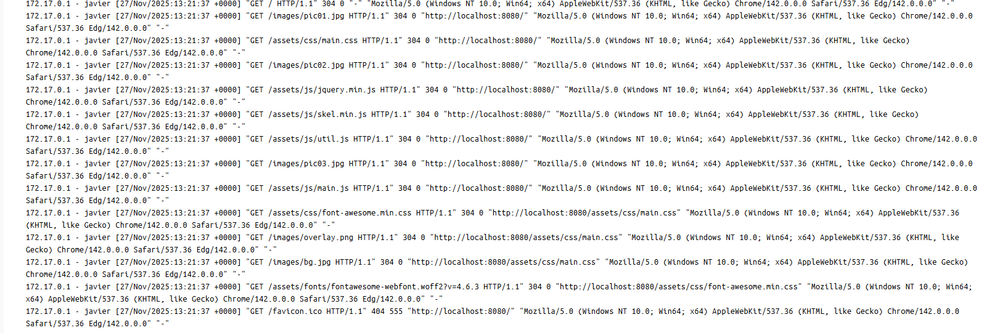

Como vemos en esta imagen, no nos da ningún error al iniciar con un usuario correcto, y nos cargan correctamente todos los archivos de el sitio web.

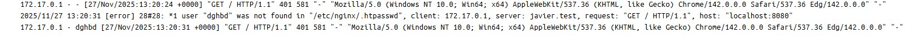

Pero como podemos comprobar en esta captura, nos da un error de que el usuario que se ha intentado introducir no fue encontrado en el archivo **htpasswd** y por lo tanto no tiene acceso.

Lo que vamos a hacer a continuación, es restringir una sección de nuestro sitio web en concreto, en mi caso contact.html, para ello debemos editar el fichero **nginx.conf**, crear otra 
**location /contact.html**, y poniéndole la restricción a esa location, y quitándosela al **location /**, y como podemos comprobar o para el apartado de contact.html sí nos pide las credenciales:

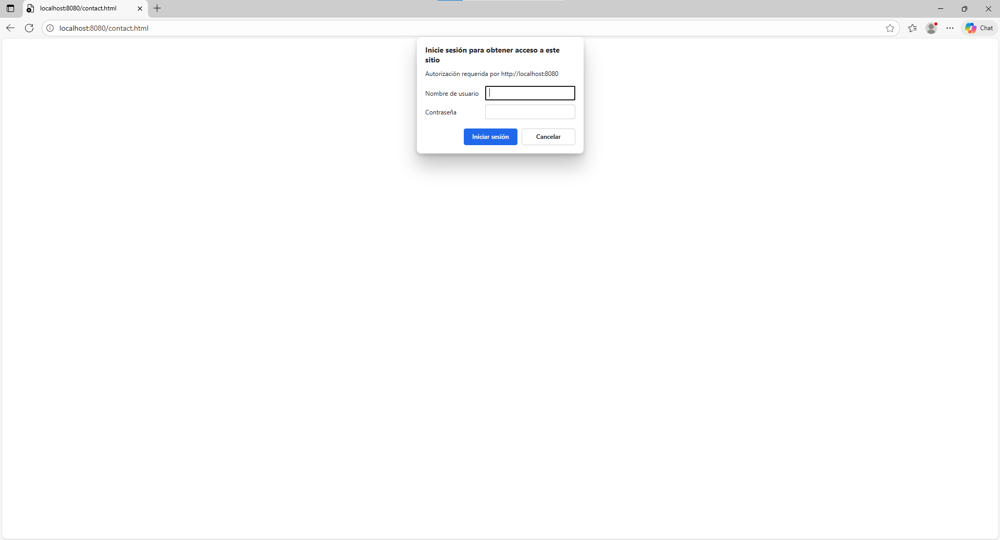

Ahora lo que vamos a hacer es bloquear la IP de nuestra máquina anfitriona para que no pueda acceder al sitio web, esto se consigue modificando el archivo de configuración **nginx.conf**, haciendole un **deny** a la IP de nuestro servidor y un **allow** para todos los demás, pero también hay que poner un **satisfy all**, que hace que se realize todo:

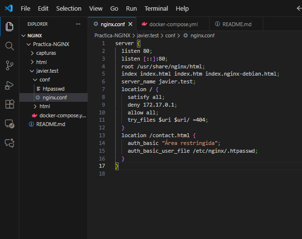

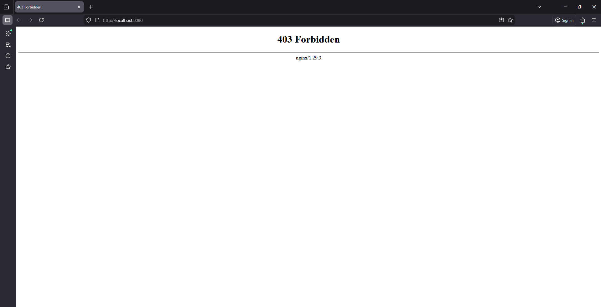

Y como hemos visto en la anteiror captura, no accedemos al sitio web, pero donde mejor se ve el error es en el log, el cuál nos pone que el acceso para la IP de nuestro equipo:

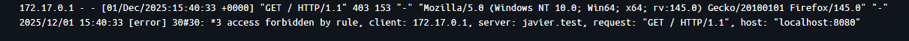

Y para finalizar, vamos a poner, que la persona que entre al sitio web, debe de tener un usuario y una IP válida, por tanto volvemos a editar el archivo **nginx.conf**, pero esta vez, invertimos el **deny** y el **allow**, le ponemos el deny a todos los demás y el allow a nuestra IP:

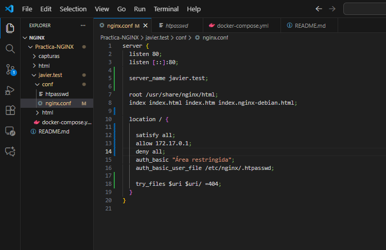

Y ahora como vemos en la siguiente captura, entramos con nuestra IP y con un usuario correcto:

Y así podemos meter un sistema de autentificación en un sitio web.

Una vez hecho un sistema de autentificación, vamos a añadirle un certificado autofirmado a nuestro servidor.

Para ello primeramente tenemos que añadir a nuestro archivo **host** de nuestra máquina anfitriona, dos registros, los cuáles serán un nombre de servidor y un registro DNS.

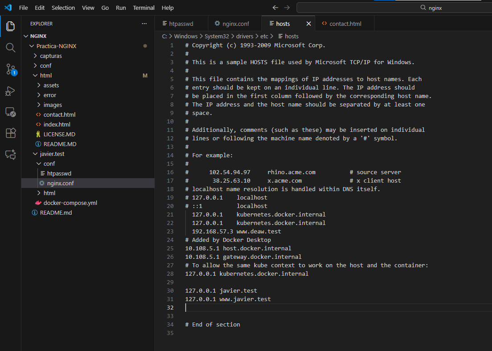

Y una vez añadido esto, vamos a comprobar mediante un ping que funciona de forma correcta:

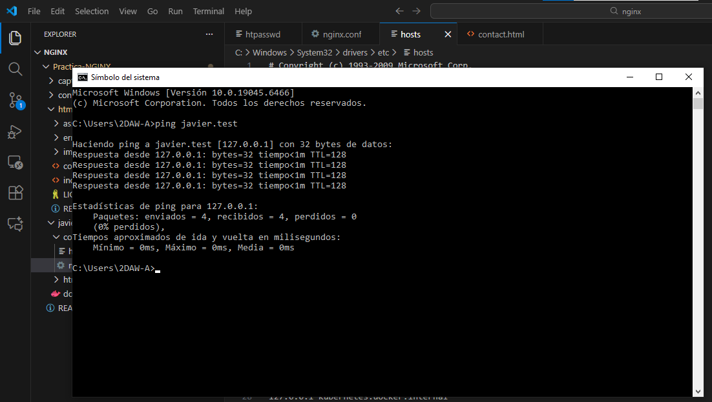

Ahora tenemos que pasar a crear el archivo de configuración **javier.test.conf** en nuestra carpeta **conf** para nuestro dominio y añadiremos la directiva **server_name** con los nombres de nuestro servidor.

Ahora vamos a crear la clave SSL y el certificado mediante los siguientes comandos( el docker run tendremos que ajustarlo a nuestro nombre de server y demás parámetros ):

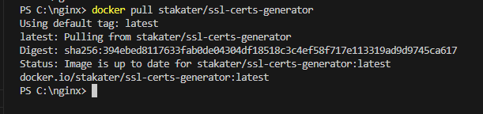

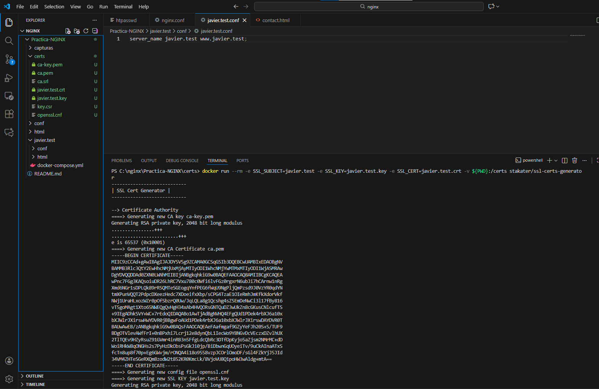

Una vez creado el certificado y guardado en la carpeta certs de nuestro servidor, vamos a pasar a modificar nuestro archivo de configuración **javier.test.conf** añadiendole los puertos de escucha, la ubicación de los certificados, etc...

Y cuando editemos el archivo ejecutamos un nuevo docker run, para poder lanzar nuestro servidor web:

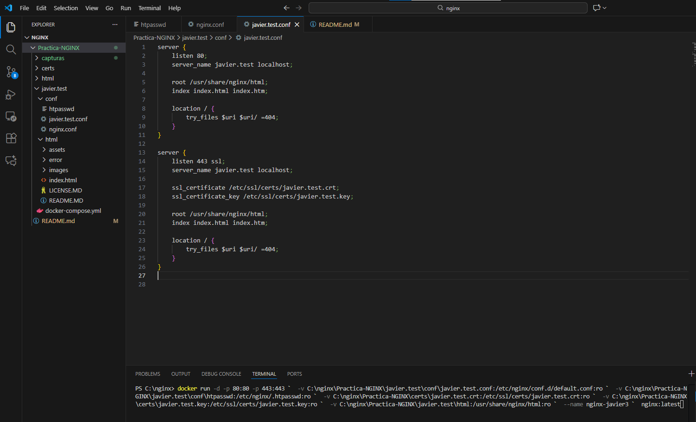

Ahora vamos a comprobar que poniendo en el navegador por ejemplo **javier.test** nos va a salir el contenido principal de nuestra página:

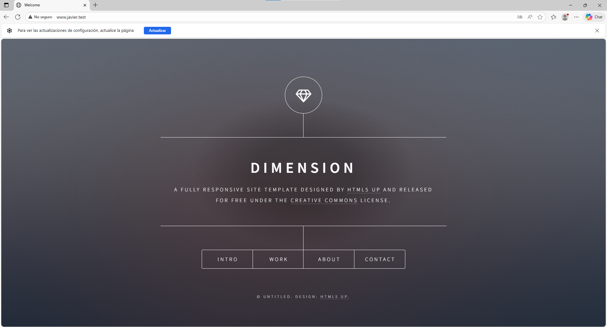

Pero como podemos observar arriba nos aparece como que el lugar no es seguro, pero no es problema nuestro o de nuestro certificado autofirmado, si no de los navegadores, porque como puedes comprobar en la siguiente captura, no se fían ya que no vienen de una entidad registrada

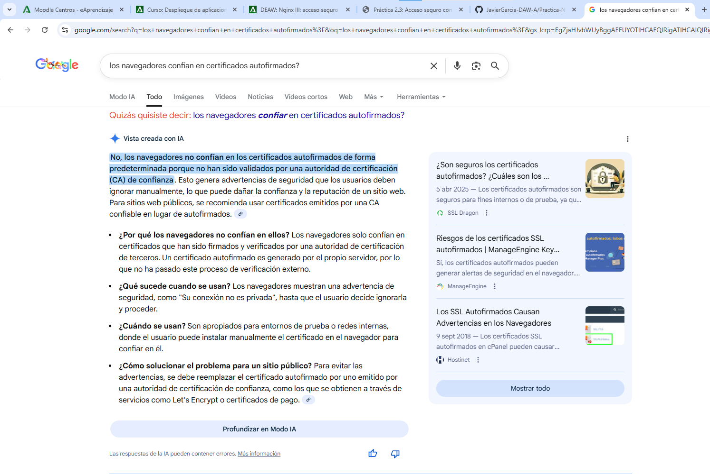

Y de esta forma habríamos terminado todas las prácticas relativas a NGINX.

